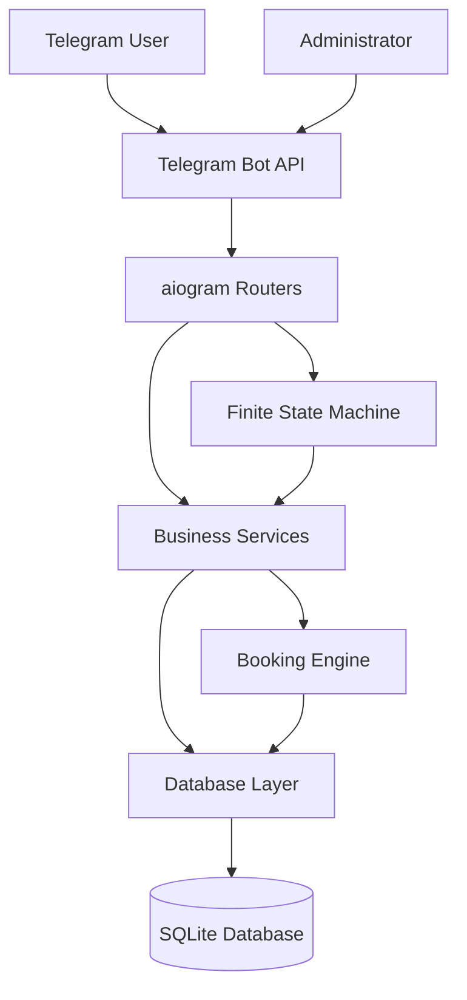
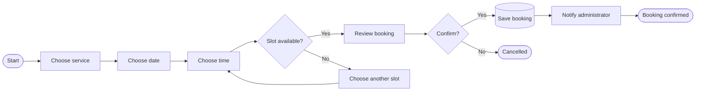

<p align="center">
  
</p>

<p align="center">
  <strong>A production-ready Telegram appointment booking system for service-based businesses.</strong>
</p>

<p align="center">
  <a href="#features">Features</a> •
  <a href="#demo">Demo</a> •
  <a href="#architecture">Architecture</a> •
  <a href="#installation">Installation</a> •
  <a href="#configuration">Configuration</a> •
  <a href="#project-structure">Project Structure</a>
</p>

<p align="center">
  
  
  
  
</p>

---

## Overview

**BookingBot** is a modular Telegram bot that allows customers to book appointments without leaving Telegram.

Customers can select a service, choose an available date and time, confirm a booking, review upcoming appointments, and cancel when necessary. Administrators receive booking notifications and can manage services, statistics, broadcasts, and other operational tasks through a protected admin interface.

The project is designed as a reusable foundation for appointment-based businesses such as:

- barbershops and beauty salons;
- tutors and consultants;
- photographers and fitness coaches;
- repair and maintenance services;
- clinics and private practices;
- any business that works with scheduled appointments.

---

## Features

### Customer experience

- `/start` onboarding and main menu
- service catalog with price and duration
- dynamic booking calendar
- automatic available-time generation
- booking confirmation before saving
- personal **My Bookings** section
- appointment cancellation
- clear validation and error messages
- prevention of duplicate bookings
- prevention of overlapping appointments

### Administrator tools

- protected admin panel
- Telegram ID-based access control
- booking notifications
- service creation
- service editing
- service deletion
- configurable service price and duration
- booking statistics
- broadcast messages
- customer profile information

### Booking engine

- configurable working days
- configurable working hours
- configurable booking horizon
- minimum booking notice
- configurable slot interval
- service-duration-aware scheduling
- occupied-slot filtering
- conflict validation before database commit

### Engineering highlights

- asynchronous aiogram 3 application
- modular router architecture
- finite-state-machine booking flows
- SQLAlchemy database layer
- environment-based configuration
- reusable keyboards and callback data
- separation of handlers, services, models, and database logic
- structured logging
- clean startup and shutdown flow

---

## Architecture



### Application layers

| Layer | Responsibility |
|---|---|
| Handlers | Receive Telegram updates and control conversation flows |
| States | Store temporary FSM progress during multi-step operations |
| Keyboards | Build inline and reply keyboards |
| Services | Contain reusable business rules |
| Booking engine | Generate and validate appointment availability |
| Database | Persist users, services, and bookings |
| Configuration | Load environment variables and runtime settings |

---

## Booking Flow



---

## Demo

### Client Booking Flow

Complete customer booking journey:

- welcome screen;
- service selection;
- date selection;
- available time selection;
- booking review;
- booking confirmation;
- My Bookings.

[▶ Watch the client booking demo](docs/assets/demo/booking-client-demo.mp4)

---

### Admin Dashboard

Administrative workflow demonstration:

- admin panel;
- booking management;
- service management;
- working-hours configuration;
- operational controls.

[▶ Watch the admin dashboard demo](docs/assets/demo/booking-admin-demo.mp4)

---

## Project Structure

The exact structure may differ slightly depending on the current project version.

```text
BookingBot/
├── app/
│   ├── admin/
│   ├── core/
│   ├── database/
│   │   ├── models/
│   │   ├── repositories/
│   │   └── session.py
│   ├── handlers/
│   │   ├── admin/
│   │   ├── booking_flow/
│   │   ├── cancellation/
│   │   ├── profile/
│   │   └── start.py
│   ├── keyboards/
│   ├── middlewares/
│   ├── services/
│   ├── states/
│   └── main.py
├── data/
├── docs/
│   └── assets/
│       ├── bookingbot-banner.svg
│       ├── booking-demo.gif
│       └── screenshots/
├── .env.example
├── .gitignore
├── requirements.txt
├── README.md
└── LICENSE
```

---

## Requirements

- Python 3.11 or newer
- Telegram bot token from BotFather
- Git
- SQLite is used by default

---

## Installation

### 1. Clone the repository

```bash
git clone https://github.com/YOUR_USERNAME/BookingBot.git
cd BookingBot
```

### 2. Create a virtual environment

Windows PowerShell:

```powershell
python -m venv .venv
.\.venv\Scripts\Activate.ps1
```

Windows Command Prompt:

```cmd
python -m venv .venv
.venv\Scripts\activate.bat
```

Linux or macOS:

```bash
python3 -m venv .venv
source .venv/bin/activate
```

### 3. Install dependencies

```bash
python -m pip install --upgrade pip
pip install -r requirements.txt
```

### 4. Create the environment file

Windows PowerShell:

```powershell
Copy-Item .env.example .env
```

Linux or macOS:

```bash
cp .env.example .env
```

### 5. Configure the bot

Open `.env` and set your Telegram bot token and administrator IDs.

### 6. Run the application

```bash
python -m app.main
```

Use the actual project entry point when it differs from the example above.

---

## Configuration

Example `.env` file:

```env
BOT_TOKEN=your_telegram_bot_token
ADMIN_IDS=123456789

DATABASE_URL=sqlite+aiosqlite:///data/booking.db

WORKING_DAYS=0,1,2,3,4
WORKING_HOUR_START=9
WORKING_HOUR_END=18

BOOKING_DAYS_AHEAD=14
MINIMUM_BOOKING_NOTICE_MINUTES=60
BOOKING_SLOT_INTERVAL_MINUTES=30

APP_ENV=development
LOG_LEVEL=INFO
```

### Configuration reference

| Variable | Description | Example |
|---|---|---|
| `BOT_TOKEN` | Telegram bot token | `123456:ABC...` |
| `ADMIN_IDS` | Comma-separated administrator IDs | `123456789,987654321` |
| `DATABASE_URL` | SQLAlchemy database URL | `sqlite+aiosqlite:///data/booking.db` |
| `WORKING_DAYS` | Working weekdays where Monday is `0` | `0,1,2,3,4` |
| `WORKING_HOUR_START` | Start of the working day | `9` |
| `WORKING_HOUR_END` | End of the working day | `18` |
| `BOOKING_DAYS_AHEAD` | Number of future days available | `14` |
| `MINIMUM_BOOKING_NOTICE_MINUTES` | Minimum notice before an appointment | `60` |
| `BOOKING_SLOT_INTERVAL_MINUTES` | Interval between generated slots | `30` |
| `APP_ENV` | Runtime environment | `development` |
| `LOG_LEVEL` | Logging level | `INFO` |

Do not commit the real `.env` file.

---

## Database

The default setup uses SQLite because it is simple to run locally and requires no external server.

Typical stored entities:

### User

- Telegram user ID
- username
- first name
- last name
- registration date

### Service

- service name
- description
- price
- duration
- active status

### Booking

- customer
- service
- appointment date
- start time
- end time
- status
- creation timestamp

The database layer can later be migrated to PostgreSQL without changing the Telegram interface.

---

## Scheduling Rules

A time slot is offered only when all required conditions are satisfied:

1. The selected day is a working day.
2. The appointment starts inside working hours.
3. The complete service duration fits inside working hours.
4. The appointment respects the minimum booking notice.
5. The time is inside the configured booking horizon.
6. No existing booking overlaps the requested interval.
7. The customer does not already have a conflicting duplicate booking.

This validation must be repeated immediately before saving the booking because another customer may reserve the same slot after it was displayed.

---

## Security

- Bot secrets are stored in environment variables.
- Administrative handlers verify the Telegram user ID.
- Booking conflicts are checked before saving.
- User input is validated before database operations.
- Database files and `.env` are excluded from version control.
- Broadcast functionality is available only to administrators.

Recommended production improvements:

- PostgreSQL instead of a local SQLite file
- Redis-backed FSM storage
- database backups
- process supervision
- HTTPS webhook deployment
- rate limiting
- centralized error tracking

---

## Running in Development

```bash
python -m app.main
```

Useful checks:

```bash
python -m compileall app
```

```bash
pip check
```

Optional formatting and static analysis:

```bash
ruff check .
ruff format --check .
```

---

## Deployment

BookingBot can be deployed using long polling or Telegram webhooks.

Possible deployment platforms:

- VPS
- Docker host
- Railway
- Render
- Fly.io
- cloud virtual machine

Recommended production stack:

```text
Telegram
   ↓
BookingBot application
   ↓
Redis FSM storage
   ↓
PostgreSQL
   ↓
Automated backups and monitoring
```

Keep production credentials in the hosting platform's environment-variable manager.

---

## Customization

The project can be adapted for different businesses by changing:

- service names;
- prices;
- service durations;
- working days;
- working hours;
- booking horizon;
- slot interval;
- minimum notice;
- interface text;
- branding;
- administrator IDs.

Possible custom additions:

- multilingual interface;
- employee selection;
- multiple branches;
- customer reminders;
- deposits and payments;
- Google Calendar synchronization;
- CRM integration;
- rescheduling;
- promo codes;
- analytics dashboard.

---

## Roadmap

- [x] Customer booking flow
- [x] Dynamic calendar
- [x] Available slot calculation
- [x] Booking conflict prevention
- [x] Booking cancellation
- [x] My Bookings
- [x] Admin notifications
- [x] Service management
- [x] Statistics
- [x] Broadcast messages
- [x] Configurable schedule
- [ ] PostgreSQL production configuration
- [ ] Redis FSM storage
- [ ] Docker deployment
- [ ] Automated tests
- [ ] Google Calendar synchronization
- [ ] Online payments
- [ ] Multi-language support

---

## Portfolio Value

This project demonstrates practical experience with:

- Telegram Bot API development;
- asynchronous Python;
- aiogram 3 routers and middleware;
- multi-step FSM conversations;
- relational database design;
- SQLAlchemy;
- business-rule validation;
- appointment conflict detection;
- administrative access control;
- project configuration;
- modular application architecture.

It is designed to represent a realistic client project rather than a minimal tutorial bot.

---

## Contributing

Contributions, issues, and feature requests are welcome.

1. Fork the repository.
2. Create a feature branch.
3. Commit your changes.
4. Push the branch.
5. Open a pull request.

```bash
git checkout -b feature/my-improvement
git commit -m "Add my improvement"
git push origin feature/my-improvement
```

---

## License

This project is available under the [MIT License](LICENSE).

---

## Author

Developed as part of a professional Python and Telegram bot portfolio.

<p align="center">
  <strong>BookingBot</strong><br>
  Book. Manage. Automate.
</p>
